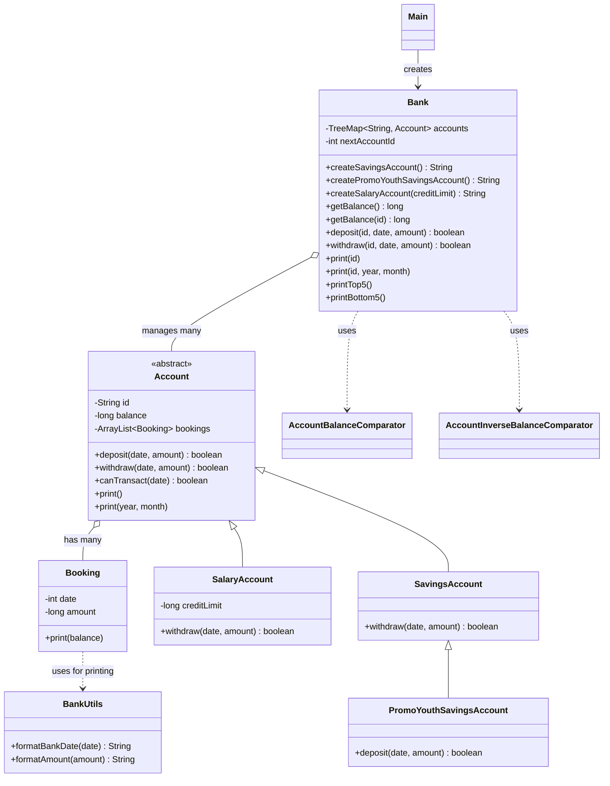

# Bank Simulation: How the Software Works

Notes from going through the code, starting at `Main` and then class by class. Everything here is checked against the source files (package `ch.schule`).

---

## 1. Overview

- Small bank simulation in Java
- One `Bank` manages many accounts, stored by their ID
- Three account types, all based on the abstract class `Account`:
  - `SavingsAccount`
  - `PromoYouthSavingsAccount` (a savings account with a deposit bonus)
  - `SalaryAccount` (can go into the minus up to a credit limit)
- Every account keeps a list of `Booking` objects (its transaction history) and can print an account statement
- `BankUtils` formats dates and amounts for the statements
- Two comparators sort accounts by balance (used for the top 5 / bottom 5 lists)

### Units and conventions

- **Amounts** are stored as `long` in **Millirappen**: 1 Franken = 100 Rappen = 100'000 Millirappen
- **Dates** are `int` "bank days" since 1.1.1970
  - 1 year = 360 days, 1 month = 30 days (no real calendar)
- Money values are always `long`, dates always `int`

---

## 2. Class Diagram

---

## 3. `Main`

- Creates a new `Bank` (`ubs`)
- Creates a promo youth savings account
- Creates a salary account with `createSalaryAccount(12000)`
  - **Careful:** the credit limit has to be negative, so a positive `12000` is rejected and `null` is returned. In this call no account is created.
- Comment in the code: how can you prevent that more than one `Bank` object is created? (this is the **Singleton** pattern: private constructor + one static instance)

---

## 4. `Bank`

The central class. It owns all accounts and forwards actions to them.

### Fields

| Field | Type | Meaning |
|---|---|---|
| `accounts` | `TreeMap<String, Account>` | All accounts by ID, sorted by ID (private) |
| `nextAccountId` | `int` | Counter for new IDs, starts at **1000** (private) |

### Creating accounts

All create-methods work the same way:

1. Build the ID: **prefix + `nextAccountId`**
2. Increase `nextAccountId`
3. Create the account object and `accounts.put(id, account)`
4. Return the ID

| Method | ID example | Account created |
|---|---|---|
| `createSavingsAccount()` | `S-1000` | `SavingsAccount` |
| `createPromoYouthSavingsAccount()` | `Y-1001` | `PromoYouthSavingsAccount` (`Y` = Youth) |
| `createSalaryAccount(long creditLimit)` | `P-1002` | `SalaryAccount` |

- The counter is shared by all account types, so IDs never repeat
- **Salary account check:** `if (creditLimit > 0) return null;`
  - The credit limit must be **zero or negative** (e.g. `-500000` means the balance may go down to -500000)
  - Invalid parameter -> `null` instead of an ID, and the counter is not increased

### Other methods

| Method | What it does |
|---|---|
| `getBalance()` | Balance **of the bank itself**: goes through all accounts and **subtracts** each balance. Customer money counts as a debt of the bank, so the result is the negative sum |
| `getBalance(id)` | Balance of one account. Account not found -> `0` |
| `deposit(id, date, amount)` | Looks up the account. Not found -> `false`. Otherwise calls `account.deposit(...)` and returns its result |
| `withdraw(id, date, amount)` | Same as `deposit`, but calls `account.withdraw(...)` |
| `print(id)` | Prints the full account statement. Account not found -> nothing happens |
| `print(id, year, month)` | Prints the statement for one month |
| `printTop5()` | Copies all accounts into an array, sorts with `AccountBalanceComparator` (highest first), prints the first 5 as `ID: balance` |
| `printBottom5()` | Same, but with `AccountInverseBalanceComparator` (lowest first) |

- Pattern in `deposit` / `withdraw` / `print`: **find the account -> if `null`, stop -> otherwise delegate to the account**
- `Bank` only finds accounts and creates them. The actual rules live in the account classes

### Small things I noticed

- Javadoc of `printBottom5()` says "highest balance", but it prints the **lowest** (copy and paste)
- Unused field `account` with getter / setter (looks generated from the UML tool)

---

## 5. `Account` (abstract base class)

### Fields

| Field | Meaning |
|---|---|
| `id` | Account number (can contain letters and special characters) |
| `balance` | Current balance in Millirappen, starts at `0` |
| `bookings` | `ArrayList<Booking>`, the transaction history |

- Constructor `Account(String id)` sets the ID, balance `0` and an empty booking list
- `abstract` -> you cannot create an `Account` directly, only a subclass

### Methods

- **`canTransact(date)`**
  - No bookings yet -> `true`
  - Otherwise `true` only if `date >= date of the last booking`
  - So **bookings must be in chronological order**, no transactions in the past
- **`deposit(date, amount)`**
  - `false` if `amount < 0`
  - `false` if `!canTransact(date)`
  - Otherwise: `balance += amount`, add `new Booking(date, amount)`, return `true`
- **`withdraw(date, amount)`**
  - Same two checks
  - Otherwise: `balance -= amount`, add `new Booking(date, -amount)` (**negative** amount in the booking), return `true`
  - This base version has **no limit check**. The subclasses add that and then call `super.withdraw(...)`
- **`print()`**
  - Prints the header and every booking
  - Starts at balance `0` and adds `b.getAmount()` after each booking, so the running balance is calculated again from the bookings
- **`print(year, month)`**
  - `startDate = (year - 1970) * 360 + (month - 1) * 30`, `endDate = startDate + 30`
  - Loop over bookings: stop at the first one `>= endDate`, print only those `>= startDate`
  - The balance is still updated for bookings **before** the month, so the first printed line has the correct opening balance
  - Works because the bookings are sorted by date (guaranteed by `canTransact`)

### Small thing I noticed

- Unused field `booking` with getter / setter (again from the UML tool)

---

## 6. Subclasses

### `SavingsAccount extends Account`

- Overrides `withdraw`
- `if (getBalance() < amount) return false;` -> **cannot go below 0**
- Otherwise `super.withdraw(date, amount)`

### `PromoYouthSavingsAccount extends SavingsAccount`

- Overrides `deposit`
- Adds a **1% bonus**: `bonus = amount / 100`, then `super.deposit(date, amount + bonus)`
- The booking and balance already contain the bonus
- `withdraw` is inherited from `SavingsAccount` (no overdraft)

### `SalaryAccount extends Account`

- Extra field: `creditLimit` (negative number, set in the constructor)
- Overrides `withdraw`
  - `finalBalance = getBalance() - amount`
  - `if (finalBalance < creditLimit) return false;`
  - Otherwise `super.withdraw(date, amount)`
- Balance can go **into the minus, but not below the credit limit**

### Comparison

| | `SavingsAccount` | `PromoYouthSavingsAccount` | `SalaryAccount` |
|---|---|---|---|
| ID prefix | `S-` | `Y-` | `P-` |
| Balance below 0 allowed? | No | No | Yes, down to credit limit |
| `withdraw` fails when | `balance < amount` | `balance < amount` | `balance - amount < creditLimit` |
| Special | none | 1% bonus on every deposit | credit limit |

### Pattern used

- Subclass adds its **own check** first, then delegates to `super` for the common work
- `Bank` does not care which account type it is: it calls `a.deposit(...)` / `a.withdraw(...)` and the right version runs (**polymorphism**)

---

## 7. `Booking`

- One transaction line
- Fields: `date` (bank days) and `amount` (Millirappen, **positive** = deposit, **negative** = withdrawal)
- `print(balance)` prints one line: formatted date, formatted amount, and the new balance (`balance + amount`)
- Created by `Account.deposit` / `Account.withdraw`

---

## 8. `BankUtils`

Static helper class, only formatting.

- `TWO_DIGIT_FORMAT` (`"00"`) and `AMOUNT_FORMAT` (`"#,##0.00"`) are created once as constants and reused
- `formatBankDate(int date)`
  - `year = 1970 + date / 360`
  - Rest of the days: `month = 1 + date / 30`, `day = 1 + date % 30`
  - Result looks like `01.01.1970`
- `formatAmount(long amount)`
  - Millirappen -> Franken: `amount / 100000.0`
  - Pads with spaces on the left to at least 10 characters, so columns line up in the statement

---

## 9. Comparators

Both implement `Comparator<Object>` and cast the objects to `Account`. They compare `getBalance()`.

| Class | Order | Used in |
|---|---|---|
| `AccountBalanceComparator` | **Descending** (highest balance first) | `printTop5()` |
| `AccountInverseBalanceComparator` | **Ascending** (lowest balance first) | `printBottom5()` |

- Return values follow the `compare` contract: negative = first comes first, positive = second comes first, `0` = equal
- Balances are `long`, so they are compared with `<` and `>`. A simple subtraction (`b1 - b2`) would not be safe, as the result has to be cast to `int`

---

## 10. How Everything Works Together

1. `Main` creates a `Bank`
2. `Bank.create...Account(...)` builds an ID, creates the matching account and stores it in the `TreeMap`. The caller gets the ID back
3. `bank.deposit(id, date, amount)` -> `Bank` finds the account -> `Account.deposit` (or the bonus version for youth accounts) checks the amount and date, updates the balance and adds a `Booking`
4. `bank.withdraw(id, date, amount)` -> the account type checks its own limit -> `Account.withdraw` does the actual booking
5. `bank.print(id)` -> `Account.print()` -> every `Booking.print(...)` -> `BankUtils` formats date and amount
6. `bank.printTop5()` / `printBottom5()` -> sort an array of accounts with a comparator and print the first 5

### Why it is built this way

- **Inheritance:** common code (balance, bookings, printing) is in `Account`, differences are in the subclasses
- **Polymorphism:** `Bank` works with `Account` and does not need to know the type
- **Encapsulation:** all fields are `private`, access only through methods
- **Delegation:** `Bank` finds, accounts decide
